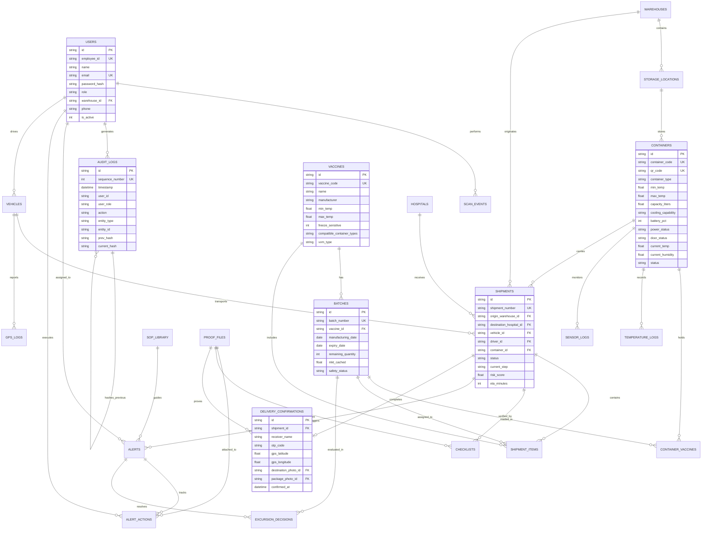

# Entity-Relationship (ER) Diagram

## Relational Data Architecture

```mermaid
erDiagram
    USERS ||--o{ SCAN_EVENTS : performs
    USERS ||--o{ AUDIT_LOGS : generates
    USERS ||--o{ ALERTS : assigned_to
    USERS ||--o{ ALERT_ACTIONS : executes
    USERS ||--o{ VEHICLES : drives

    WAREHOUSES ||--o{ STORAGE_LOCATIONS : contains
    WAREHOUSES ||--o{ SHIPMENTS : originates

    STORAGE_LOCATIONS ||--o{ CONTAINERS : stores

    VACCINES ||--o{ BATCHES : has
    VACCINES ||--o{ SHIPMENT_ITEMS : includes

    BATCHES ||--o{ CONTAINER_VACCINES : loaded_in
    BATCHES ||--o{ SHIPMENT_ITEMS : assigned_to
    BATCHES ||--o{ EXCURSION_DECISIONS : evaluated_in

    CONTAINERS ||--o{ CONTAINER_VACCINES : holds
    CONTAINERS ||--o{ TEMPERATURE_LOGS : records
    CONTAINERS ||--o{ SENSOR_LOGS : monitors
    CONTAINERS ||--o{ SHIPMENTS : carries

    HOSPITALS ||--o{ SHIPMENTS : receives

    VEHICLES ||--o{ SHIPMENTS : transports
    VEHICLES ||--o{ GPS_LOGS : reports

    SHIPMENTS ||--o{ SHIPMENT_ITEMS : contains
    SHIPMENTS ||--o{ CHECKLISTS : verified_by
    SHIPMENTS ||--o{ ALERTS : triggers
    SHIPMENTS ||--o| DELIVERY_CONFIRMATIONS : completes

    SOP_LIBRARY ||--o{ ALERTS : guides
    ALERTS ||--o{ ALERT_ACTIONS : tracks
    ALERTS ||--o{ EXCURSION_DECISIONS : resolves

    PROOF_FILES ||--o{ ALERT_ACTIONS : attached_to
    PROOF_FILES ||--o{ CHECKLISTS : verifies
    PROOF_FILES ||--o{ DELIVERY_CONFIRMATIONS : proves

    AUDIT_LOGS ||--o{ AUDIT_LOGS : hashes_previous

    USERS {
        string id PK
        string employee_id UK
        string name
        string email UK
        string password_hash
        string role
        string warehouse_id FK
        string phone
        int is_active
    }

    VACCINES {
        string id PK
        string vaccine_code UK
        string name
        string manufacturer
        float min_temp
        float max_temp
        int freeze_sensitive
        string compatible_container_types
        string vvm_type
    }

    BATCHES {
        string id PK
        string batch_number UK
        string vaccine_id FK
        date manufacturing_date
        date expiry_date
        int remaining_quantity
        float mkt_cached
        string safety_status
    }

    CONTAINERS {
        string id PK
        string container_code UK
        string qr_code UK
        string container_type
        float min_temp
        float max_temp
        float capacity_liters
        string cooling_capability
        int battery_pct
        string power_status
        string door_status
        float current_temp
        float current_humidity
        string status
    }

    SHIPMENTS {
        string id PK
        string shipment_number UK
        string origin_warehouse_id FK
        string destination_hospital_id FK
        string vehicle_id FK
        string driver_id FK
        string container_id FK
        string status
        string current_step
        float risk_score
        int eta_minutes
    }

    DELIVERY_CONFIRMATIONS {
        string id PK
        string shipment_id FK
        string receiver_name
        string otp_code
        float gps_latitude
        float gps_longitude
        string destination_photo_id FK
        string package_photo_id FK
        datetime confirmed_at
    }

    AUDIT_LOGS {
        string id PK
        int sequence_number UK
        datetime timestamp
        string user_id
        string user_role
        string action
        string entity_type
        string entity_id
        string prev_hash
        string current_hash
    }
```
